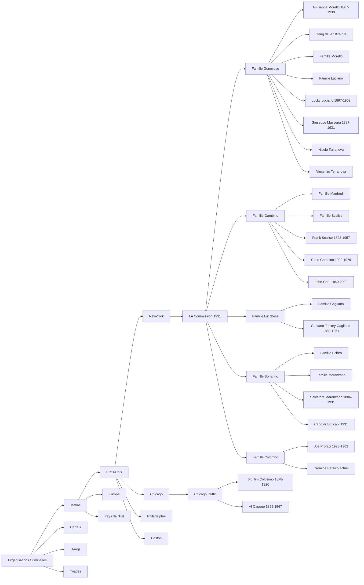

```mermaid
graph LR
  A[Organisations Criminelles] --> B[Mafias]
  A --> Z1[Cartels]
  A --> Z2[Gangs]
  A --> Z3[Triades]

  B --> C1[Etats-Unis]
  B --> C2[Europe]
  B --> C3[Pays de l'Est]

  C1 --> D1[New-York]
  C1 --> D2[Chicago]
  C1 --> D3[Philadelphie]
  C1 --> D4[Boston]

  D1 --> E[LA Commission 1931]

  E --> F1[Famille Genovese]
  F1 --> F1a[Giuseppe Morello 1867-1930]
  F1 --> F1b[Gang de la 107e rue]
  F1 --> F1c[Famille Morello]
  F1 --> F1d[Famille Luciano]
  F1 --> F1e[Lucky Luciano 1897-1962]
  F1 --> F1f[Giuseppe Masseria 1887-1931]
  F1 --> F1g[Nicolo Terranova]
  F1 --> F1h[Vincenzo Terranova]

  E --> F2[Famille Gambino]
  F2 --> F2a[Famille Manfredi]
  F2 --> F2b[Famille Scalise]
  F2 --> F2c[Frank Scalise 1893-1957]
  F2 --> F2d[Carlo Gambino 1902-1976]
  F2 --> F2e[John Gotti 1940-2002]

  E --> F3[Famille Lucchese]
  F3 --> F3a[Famille Gagliano]
  F3 --> F3b[Gaetano Tommy Gagliano 1883-1951]

  E --> F4[Famille Bonanno]
  F4 --> F4a[Famille Schiro]
  F4 --> F4b[Famille Moranzano]
  F4 --> F4c[Salvatore Maranzano 1886-1931]
  F4 --> F4d[Capo di tutti capi 1931]

  E --> F5[Famille Colombo]
  F5 --> F5a[Joe Profaci 1928-1962]
  F5 --> F5b[Carmine Persico actuel]

  D2 --> G1[Chicago Outfit]
  G1 --> G1a[Big Jim Colosimo 1878-1920]
  G1 --> G1b[Al Capone 1899-1947]
```

## Liens vers les fiches

- [[Famille Genovese]]
- [[Famille Gambino]]
- [[Famille Lucchese]]
- [[Famille Bonanno]]
- [[Famille Colombo]]
